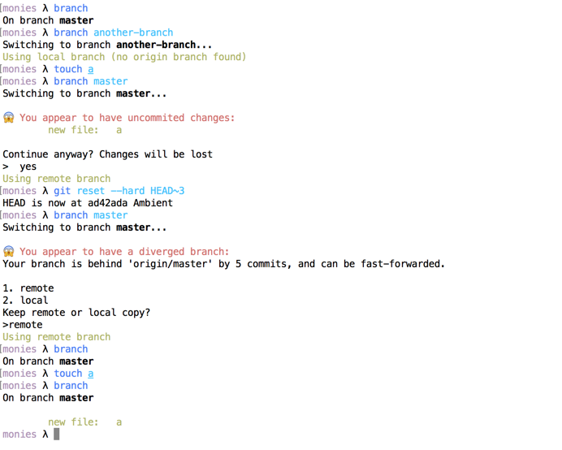

# branch cli

`branch` simplifies the average workflow of Git. By working on simple assumptions of workflow, it's easier, more memorable, quicker and safer to use.

The assumptions `branch` makes are:
- You don't care about staging/unstaging files. All changes are treated as staged.
- You use a single remote (origin) and your local "my-branch" is always going to have the upstream as "origin/my-branch"

## Installation
`gem install branch_cli`

## Basic usage

- Use `branch` as an alternative for `git status`
- to change branch, use `branch BRANCH-NAME`
- To get a list of the most recent branches `branch --list`

## Features

- When changing branch
  - Warns if you have local changes and prompts on whether to continue
  - Warns if the remote branch has diverged and prompts on whether you want to keep your local branch or to reset with the remote
- Formatted list of most recent branches with `--list` argument
- Choose a branch from a list using `--choice` argument

## Future ideas/plans

- Recording base branch when creating a new one
- Suggestion to rebase if it detects that you should (i.e. automatic `git pull --rebase` and `git rebase origin/base-branch`)
- Nicer flow for rebasing (visual representation of progress)
- Clear indication of files in conflict (as well as automatic indication of when you have resolved them)
